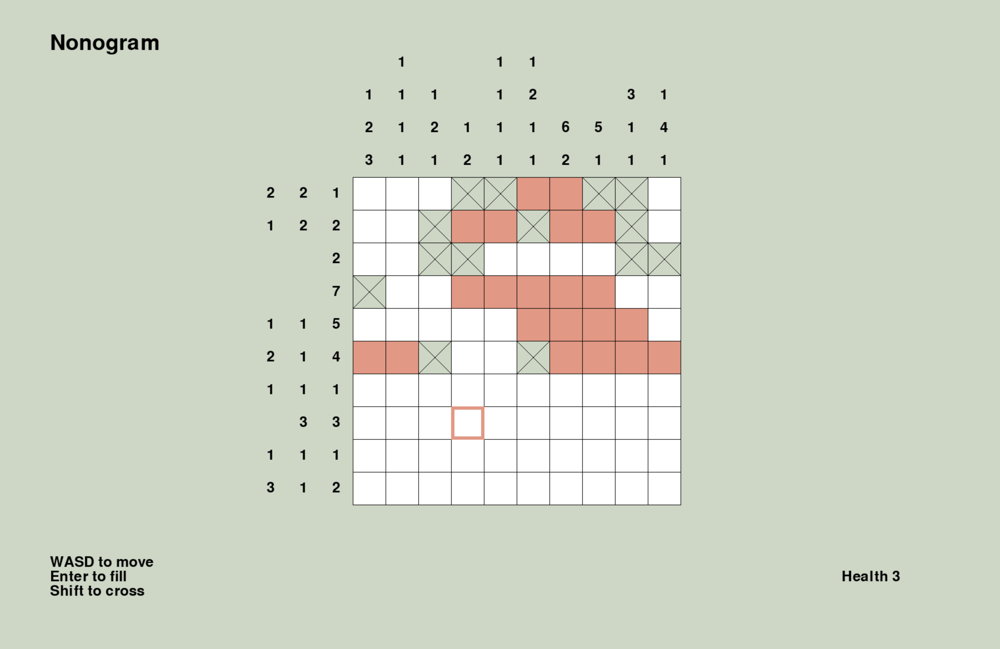

# Nonogram

According to [Wikipedia](https://en.wikipedia.org/wiki/Nonogram), Nonogram is a 'logic puzzle game'. For me, it was a game that I enjoyed on my phone when I had no internet connection. One day, out of boredom, I decided to build it myself. Well, here is the result with Python and a minimal UI thanks to Pygame.

### Setup

If you would like to try it (pretty unlikely, but here we go), first clone the repo, then use these commands (or similar, based on your system, I've used MacOS):

Navigate to the directory and create a virtual environment:

```bash
$ cd Nonogram
$ python3 -m venv .venv
```

Activate the virtual environment and install the requirements (basically just Pygame):

```bash
$ source .venv/bin/activate
$ pip3 install -r requirements.txt
```

You can run the game now. This command is enough from now on:

```bash
$ python3 nonogram.py
```

And when trying to close the virtual env:

```bash
$ deactivate
```

### Screenshot

Here is how it looks:

